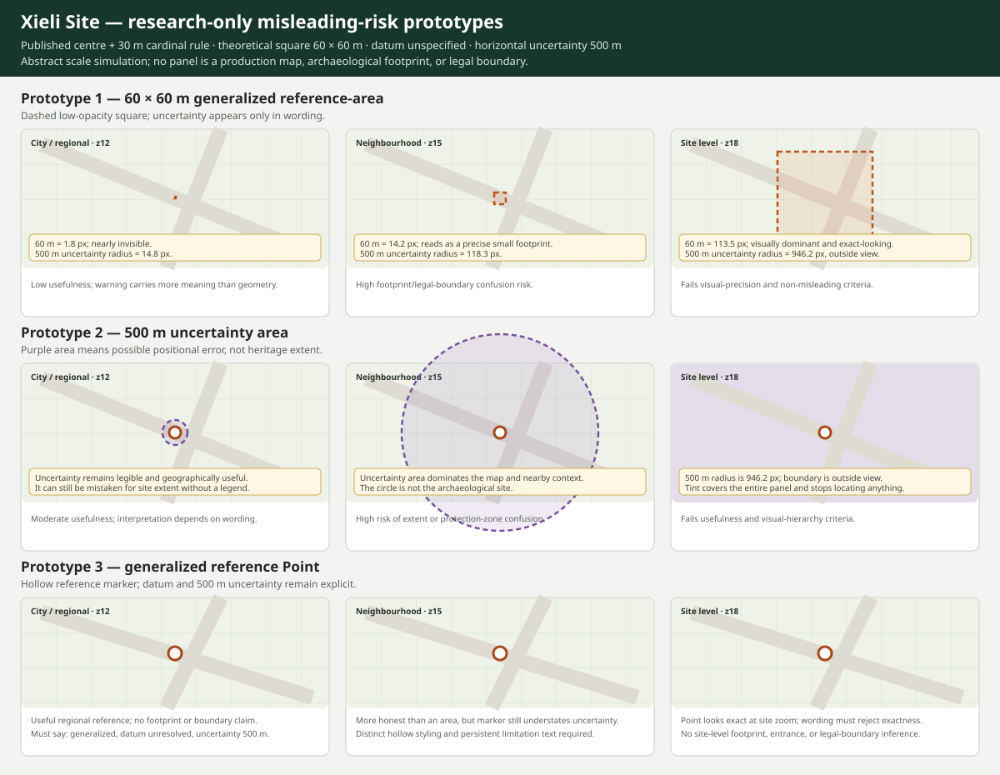

# Phase 15C-7 - Xieli Site misleading-risk review

## Decision

**Do not approve the proposed 60 × 60 metre generalized reference-area Polygon. Recommend a generalized reference Point only, subject to separate explicit implementation approval.**

This is outcome **C - Point instead** among the four alternatives evaluated in
this historical review. Under the controlling standalone publication policy,
the equivalent future status is **Point now, shape later**: a generalized Point
may be reconsidered for publication, while any later approved area would
supersede the Point rather than appear alongside it.

The Point recommendation is still research-only. Xieli remains unpublished. Xiabu remains unpublished. No production data, public-location decision, generated GeoJSON, application code, test, workflow, Firebase file, or package file changes in this phase.

## Authority and evidence reviewed

This decision applies the controlling [official-record publication policy](../policy/official-record-publication-policy.md) and supersedes the Xieli shape recommendation in the historical [Phase 15C-6 batch plan](../plans/phase-15c-6-official-record-publication-policy-and-batch-plan.md). It preserves the evidence and cautions in:

- the historical [Phase 15C-3 initial geometry audit](./phase-15c-3-first-real-official-geometry.md);
- the historical [Phase 15C-4 mixed-geometry re-audit](./phase-15c-4-xinyu-mixed-geometry-reaudit.md);
- the authoritative detailed [Phase 15C-5 Xiabu evidence record](./phase-15c-5-xiabu-geometry-pilot.md).

Known Xieli evidence:

- official name: 斜里遗址;
- English project name: Xieli Site;
- sixth-batch designation number: `6-1-040`;
- type: archaeological site;
- locality: Xieli Village, Xinyu;
- official annex: 江西省人民政府关于公布第六批江西省文物保护单位保护范围的通知, `赣府字〔2019〕18号`, dated 2019-03-07;
- relevant row: printed page 10 of the public archival annex;
- published centre: `27°45′45.3″ N, 114°55′11.2″ E`;
- arithmetic decimal transcription: `[114.919777778, 27.762583333]`;
- published rule: extend 30 metres east, south, west, and north from the stated GPS centre;
- theoretical construction: a 60 × 60 metre square;
- source datum: unspecified;
- official WGS84 vertices: none;
- authority-supplied GIS boundary: none;
- authority-confirmed WGS84 point: none.

The relevant official text states:

> 以GPS（北纬27°45′45.3″，东经114°55′11.2″）为中心，向东、南、西、北四面方向各延伸30米。

The arithmetic transcription is not a datum conversion. It must not be relabelled as datum-certified WGS84, and the theoretical square must not be described as an official legal boundary.

Sources:

- [Public archival protection-range annex](https://commons.wikimedia.org/wiki/File%3A%E7%AC%AC%E5%85%AD%E6%89%B9%E6%B1%9F%E8%A5%BF%E7%9C%81%E6%96%87%E7%89%A9%E4%BF%9D%E6%8A%A4%E5%8D%95%E4%BD%8D%E4%BF%9D%E6%8A%A4%E8%8C%83%E5%9B%B4%E4%B8%80%E8%A7%88%E8%A1%A8.pdf)
- [Xieli Site, Xinyu Museum](https://www.xysmuseum.com/596.html)
- [Current Xinyu official register](https://wxj.xinyu.gov.cn/wxj/qtygwjfsh/2025-12/26/content_8c20af69612748c0ac4570ce91627770.shtml)

The required project-geometry caution remains:

> This is a project-created heritage reference geometry and not an official legal boundary.

That sentence is necessary but not sufficient to make the square visually honest.

## Prototype method

Three local research-only representations were rendered against the same abstract, non-geographic background:

1. the 60 × 60 metre generalized reference-area square;
2. a 500 metre-radius positional uncertainty area around the transcribed centre;
3. a generalized reference Point at the transcribed centre.

The prototypes were not connected to the official dataset or production renderer. The abstract background deliberately prevents the exercise from becoming an unauthorized trace or a claim about visible roads, parcels, structures, vegetation, or archaeological remains.

The retained comparison is:

The temporary browser prototype was inspected at a 1200-pixel reference width. The retained SVG is static documentation evidence, not executable prototype code.

### Scale construction

The scale simulation used Web Mercator ground resolution at latitude `27.762583°`:

`metresPerPixel = 156543.03392 × cos(latitude) ÷ 2^zoom`

| Review level | Reference zoom | Approximate metres per pixel | 60 m square width | 500 m uncertainty radius |
| --- | ---: | ---: | ---: | ---: |
| City / regional | 12 | 33.79 | 1.8 px | 14.8 px |
| Neighbourhood | 15 | 4.23 | 14.2 px | 118.3 px |
| Site level | 18 | 0.53 | 113.5 px | 946.2 px |

The prototype square ring preserved in Phase 15C-6 is closed and reproducible. Haversine review returned four sides of approximately `59.93 m`; the small difference from 60 metres is expected from decimal rounding and the simplified longitude/latitude construction. Reproducibility of the arithmetic shape does not resolve the source datum or make the shape an archaeological footprint.

## Zoom-level findings

### City / regional

- The 60 m square is about 1.8 pixels wide and is effectively invisible.
- The user receives almost all useful meaning from the label and warning, not the square.
- A 500 m uncertainty area is visible and geographically comprehensible at this scale.
- A Point is useful as a regional reference and does not claim a footprint.

### Neighbourhood

- The square becomes visible at about 14.2 pixels.
- Its regular orthogonal form reads as a deliberately surveyed footprint or legal protection box even with a dashed outline.
- The 500 m uncertainty radius occupies much of a typical map view and competes with nearby context.
- A Point remains the least area-like representation, although its styling and persistent limitation text must communicate that it is generalized.

### Site level

- The square becomes approximately 113.5 pixels wide and visually dominates the site view.
- Its corners and exact-looking dimensions imply positional confidence that the unstated datum does not support.
- The 500 m uncertainty radius is approximately 946 pixels, so its boundary lies outside a normal site-level viewport; a filled uncertainty layer covers the entire view and stops functioning as a useful locator.
- A Point also appears visually exact at this zoom, but it does not imply walls, a buried-site footprint, or a legal protection boundary. It is acceptable only with distinct generalized styling and persistent uncertainty wording.

## Four outcomes evaluated

### A - Approve the 60 × 60 m generalized reference-area Polygon

**Rejected.**

The construction is reproducible, but its visual claim is not honest at useful close zooms. A 60 m square placed with 500 m horizontal uncertainty has a positional uncertainty more than eight times the square width and more than sixteen times its half-width. At site level, the square looks exact while the uncertainty is outside the view. Dashed styling, low-opacity fill, a legend label, and the mandatory caution reduce but do not remove the footprint and legal-boundary inference.

The square therefore fails:

- visual precision not exceeding evidential precision;
- low likelihood of legal-boundary confusion;
- honest communication of uncertainty;
- useful interpretation without false exactness.

### B - Replace the square with a broader uncertainty area

**Rejected.**

A 500 m uncertainty area communicates the datum problem at regional scale, but it performs poorly at the scales where users inspect a site:

- at neighbourhood scale it dominates the map;
- at site level its edge is outside the viewport;
- a filled area can be mistaken for archaeological extent, a protection zone, or a sensitivity buffer;
- it includes land that the source does not identify as part of Xieli Site.

The uncertainty area expresses a statistical/location problem, not heritage extent. Rendering it as the primary official geometry would add more visual mass than heritage meaning.

### C - Publish a generalized reference Point instead

**Recommended for a future separately approved implementation.**

The annex itself publishes a centre coordinate, so a reference Point has a clear source meaning. The unresolved datum prevents a reviewed-location or exact-site claim, but a deliberately generalized Point with 500 m horizontal uncertainty can honestly communicate the available evidence:

- it identifies the project reference associated with the published Xieli centre;
- it does not claim a buried-site footprint;
- it does not claim the 60 m square is correctly positioned;
- it does not claim a legal protection boundary;
- it remains useful at regional and neighbourhood scales;
- the public source already discloses the centre, so the Point does not expose a previously secret coordinate.

The Point must not use `reviewed-location-point`, `approximate-site-point`, a centroid meaning, or standard wording that implies a surveyed feature position.

### D - Withhold Xieli

**Retained as the mandatory fallback, not the primary recommendation.**

Withholding is preferable if a future implementation cannot provide all of:

- distinct generalized Point styling;
- a visible generalized label;
- persistent datum and 500 m uncertainty wording;
- a popup and accessible name that reject footprint and legal-boundary meanings;
- an accepted archaeological sensitivity review.

If those conditions cannot be met without changing the Point into an exact-looking ordinary marker, Xieli must remain withheld.

## Styling assessment

### Square

The least misleading possible square prototype used:

- dashed outline;
- low-opacity fill;
- no solid reviewed-boundary style;
- “generalized project reference area” legend wording;
- the mandatory project-geometry caution.

It still looked exact at site level and is not approved.

### Uncertainty area

The prototype used:

- a purple dashed outline distinct from orange heritage geometry;
- very low-opacity fill;
- “positional uncertainty, not site extent” wording.

It still dominated close zooms and is not approved.

### Point

A future Point should use:

- a hollow or otherwise visibly generalized symbol, not reviewed-location styling;
- no enclosing square or filled uncertainty polygon;
- a visible “Generalized project reference point” label;
- the 500 m uncertainty in the popup without requiring a secondary click;
- an accessible name that includes “generalized,” “source datum unspecified,” and “500 metres uncertainty.”

No production style is changed in this review.

## Uncertainty and sensitivity assessment

The 500 m value is a conservative publication uncertainty intended to contain the unresolved datum and discourage exact-site interpretation. It is not a measured statistical confidence interval and must not be rendered as if it were a surveyed circular boundary.

Archaeological considerations:

- Xieli is an archaeological site with excavation and burial evidence;
- the official annex already publishes the centre and 30 m rule;
- a machine-readable display increases discoverability even when the source is already public;
- a precise-looking square could direct attention to an incorrectly positioned small area and imply buried-site extent;
- a broad uncertainty area exposes no more exact location but visually implicates unrelated land;
- a generalized Point adds the least new spatial claim while preserving public interpretive value.

The Point recommendation is acceptable only because the coordinate is already public and the representation is deliberately generalized. It is not approval to publish excavation locations, finds, graves, access routes, or a site footprint.

## Accessibility assessment

Proposed accessible name:

> Xieli Site — generalized project reference Point; source datum unspecified; horizontal uncertainty 500 metres.

Proposed popup wording:

> This is a project-created generalized reference Point based on the published Xieli centre. It is not a surveyed feature position, archaeological footprint, or official legal boundary. The source datum is unspecified; horizontal uncertainty is 500 metres.

The popup should also link to or name the official protection-range source and show the arithmetic source transcription. Keyboard and pointer activation must open the same feature-level content. Colour alone must not distinguish the generalized Point from reviewed geometry.

## Proposed metadata

These values are a research recommendation, not production data:

| Field | Proposed value |
| --- | --- |
| Geometry type | `Point` |
| Coordinate | `[114.919777778, 27.762583333]` |
| Coordinate qualification | Arithmetic transcription of published DMS; not a datum conversion or datum-certified WGS84 position |
| `geometryMeaning` | `generalized-reference-point` |
| `geometryPrecision` | `generalized` |
| `geometrySourceType` | `project-generalized-reference` |
| `geometrySourceLabel` | Jiangxi sixth-batch protection-range annex, Xieli row |
| `horizontalUncertaintyMetres` | `500` |
| Review status | Proposed only; separate implementation approval required |

The original DMS coordinate, unstated datum, arithmetic transcription method, review date, and exact limitation wording must remain in reviewer evidence.

## Proposed implementation scope if separately approved

1. add a stable Xieli official source record without changing official facts;
2. add one generalized Point decision using the metadata above;
3. preserve the original DMS and unspecified datum in reviewer evidence;
4. do not add the 60 m square, an uncertainty Polygon, or a duplicate centre Point;
5. ensure generalized Point styling and accessible presentation are visibly distinct from reviewed Points;
6. preserve the five existing official Points unchanged;
7. validate identity counts separately from representation counts if the new source model requires it;
8. add coordinate, metadata, sensitivity, popup, accessibility, generator, and browser coverage;
9. stop if implementation review cannot make the 500 m uncertainty persistent and understandable.

This review does not authorize any of those steps.

## Remaining risks

- The source datum may not be WGS84 or CGCS2000.
- The 500 m uncertainty is conservative rather than empirically measured.
- A Point marker can still look exact at site zoom.
- Current Point presentation may require a small, separately reviewed styling distinction.
- Machine-readable publication increases archaeological-site discoverability.
- The published centre may refer to the protection rule rather than a surveyed site centroid.
- Future authority data could materially move or replace the project reference.

Preferred evidence upgrade:

1. explicit datum confirmation for the published centre;
2. authority-supplied GIS or WGS84 point/boundary;
3. authority confirmation that machine-readable public reuse is acceptable;
4. a sensitivity decision tied to the intended public zoom and styling.

## Preserved research artifact

The static [prototype comparison](../assets/phase-15c-7-xieli-prototype-comparison.svg)
is retained as supporting visual evidence. No executable prototype is retained.

## Verification results

- Local GFM rendering passed for all three changed Markdown documents.
- All 77 internal documentation links passed.
- All 3 external links passed syntax validation.
- UTF-8 validation passed.
- All five repository JSON and GeoJSON data files parsed.
- Prototype geometry checks passed: the square ring is closed, its sides are approximately 59.93 m, the proposed Point is valid, and the proposed generalized metadata is valid under the existing schema.
- JavaScript syntax passed for all 47 repository JavaScript files.
- Provincial and official publication validation passed.
- Generated provincial and official GeoJSON outputs are byte-for-byte current.
- The bounded protected-scope audit passed without changing production data or application code.
- SVG XML validation passed.
- `git diff --check` passed.

The validation commands emitted only the repository's existing Node
`MODULE_TYPELESS_PACKAGE_JSON` warnings. They are non-blocking and do not
indicate a failure or a change introduced by this review.

## Stop point

Xieli remains unpublished. Xiabu remains unpublished. Production remains at five official Point features with no real line, polygon, area, or other non-Point geometry. No implementation batch, staging, commit, push, pull request, or deployment is authorized by this review.
